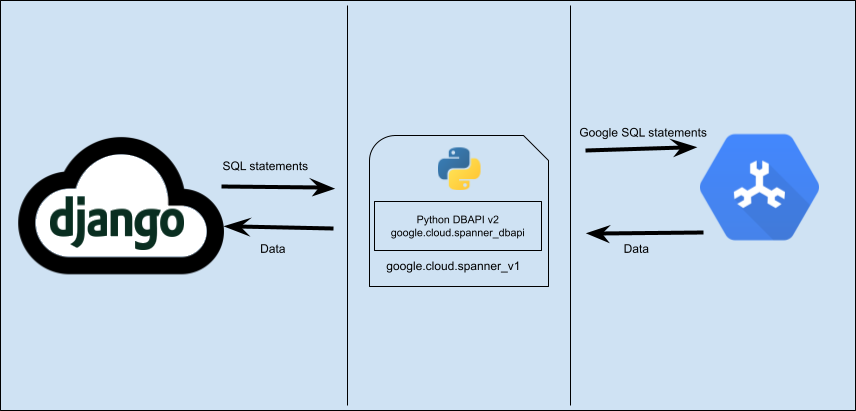

Cloud Spanner support for Django
================================

ORM plugin for using Cloud Spanner as a `database backend
<https://docs.djangoproject.com/en/2.2/ref/databases/#using-a-3rd-party-database-backend>`__
for Django.

Installation
------------

To use this library you'll need a Google Cloud Platform project with the Cloud
Spanner API enabled. See the `Cloud Spanner Python client docs
<https://github.com/googleapis/python-spanner/#quick-start>`__ for details.

Use the version of ``python-spanner-django`` that corresponds to your version
of Django.  For example, ``python-spanner-django`` 2.2.x works with Django
2.2.y. (This is the only supported version at this time.)

The minor release number of Django doesn't correspond to the minor release
number of ``python-spanner-django``. Use the latest minor release of each.

To install from PyPI:

.. code:: shell

    pip3 install django-google-spanner

To install from source:

.. code:: shell

    git clone git@github.com:googleapis/python-spanner-django.git
    cd python-spanner-django
    pip3 install -e .

Useage
------

After `installattion <#Installation>`__, you'll need to edit your Django
``settings.py`` file:

-  Add ``django_spanner`` as the very first entry in the ``INSTALLED_APPS``
   setting

   .. code:: python

       INSTALLED_APPS = [
           'spanner_django',
           ...
       ]

-  Edit the ``DATABASES`` setting to point to an EXISTING database

Format
~~~~~~

.. code:: python

    DATABASES = {
        'default': {
            'ENGINE': 'spanner_django',
            'PROJECT': '<project_id>',
            'INSTANCE': '<instance_id>',
            'NAME': '<database_name>',
            # Only include this if you need to specify where to retrieve the
            # service account JSON for the credentials to connect to Cloud Spanner.
            'OPTIONS': {
                'credentials_uri': '<credentials_uri>',
            },
        },
    }

Example
~~~~~~~

For example:

.. code:: python

    DATABASES = {
        'default': {
            'ENGINE': 'spanner_django',
            'PROJECT': 'appdev-soda-spanner-staging', # Or the GCP project-id
            'INSTANCE': 'django-dev1', # Or the Cloud Spanner instance
            'NAME': 'db1', # Or the Cloud Spanner database to use
        }
    }

Limitations
-----------

Transaction management isn't supported
~~~~~~~~~~~~~~~~~~~~~~~~~~~~~~~~~~~~~~

``python-spanner-django`` always works in ``autocommit`` mode, which is
Django's default behavior even for backends that support manual transaction
management. Transactions cannot be controlled manually with calls like
``django.db.transaction.atomic()``.

``AutoField`` generates random IDs
~~~~~~~~~~~~~~~~~~~~~~~~~~~~~~~~~~

Spanner doesn't have support for auto-generating primary key values.
Therefore, ``python-spanner-django`` monkey-patches ``AutoField`` to generate a
random UUID4. It generates a default using ``Field``'s ``default`` option which
means ``AutoField``\ s will have a value when a model instance is created. For
example:

::

    >>> ExampleModel()
    >>> ExampleModel.pk
    4229421414948291880

To avoid
`hotspotting <https://cloud.google.com/spanner/docs/schema-design#uuid_primary_key>`__,
these IDs are not monotonically increasing. This means that sorting
models by ID isn't guaranteed to return them in the order in which they
were created.

``ForeignKey`` constraints aren't created
~~~~~~~~~~~~~~~~~~~~~~~~~~~~~~~~~~~~~~~~~

Spanner doesn't support ``ON DELETE CASCADE`` when creating foreign-key
constraints so ``python-spanner-django`` `doesn't support foreign key
constraints
<https://github.com/googleapis/python-spanner-django/issues/313>`__.

Check constraints aren't supported
~~~~~~~~~~~~~~~~~~~~~~~~~~~~~~~~~~

Spanner doesn't support ``CHECK`` constraints so one isn't created for
`PositiveIntegerField
<https://docs.djangoproject.com/en/stable/ref/models/fields/#positiveintegerfield>`__
and `CheckConstraint
<https://docs.djangoproject.com/en/stable/ref/models/constraints/#checkconstraint>`__
can't be used.

``DecimalField`` isn't supported
~~~~~~~~~~~~~~~~~~~~~~~~~~~~~~~~

Spanner doesn't support a NUMERIC data type that allows storing high
precision decimal values without the possibility of data loss.

``Variance`` and ``StdDev`` database functions aren't supported
~~~~~~~~~~~~~~~~~~~~~~~~~~~~~~~~~~~~~~~~~~~~~~~~~~~~~~~~~~~~~~~

Spanner doesn't support these functions.

``Meta.order_with_respect_to`` model option isn't supported
~~~~~~~~~~~~~~~~~~~~~~~~~~~~~~~~~~~~~~~~~~~~~~~~~~~~~~~~~~~

This feature uses a column name that starts with an underscore
(``_order``) which Spanner doesn't allow.

Random ``QuerySet`` ordering isn't supported
~~~~~~~~~~~~~~~~~~~~~~~~~~~~~~~~~~~~~~~~~~~~

Spanner doesn't support it. For example:

::

    >>> ExampleModel.objects.order_by('?')
    ...
    django.db.utils.ProgrammingError: 400 Function not found: RANDOM ... FROM
    example_model ORDER BY RANDOM() ASC

Schema migrations
~~~~~~~~~~~~~~~~~

Spanner has some limitations on schema changes which you must respect:

-  Renaming tables and columns isn't supported.
-  A column's type can't be changed.
-  A table's primary key can't be altered.
-  Migrations aren't atomic since ``python-spanner-django`` doesn't support
   transactions.

``DurationField`` arithmetic doesn't work with ``DateField`` values (`#253 <https://github.com/googleapis/python-spanner-django/issues/253>`__)
~~~~~~~~~~~~~~~~~~~~~~~~~~~~~~~~~~~~~~~~~~~~~~~~~~~~~~~~~~~~~~~~~~~~~~~~~~~~~~~~~~~~~~~~~~~~~~~~~~~~~~~~~~~~~~~~~~~~~~~~~~~~~~~~~~~~~~~~~~~~~~~

Spanner requires using different functions for arithmetic depending on
the column type:

-  ``TIMESTAMP`` columns (``DateTimeField``) require ``TIMESTAMP_ADD``
   or ``TIMESTAMP_SUB``
-  ``DATE`` columns (``DateField``) require ``DATE_ADD`` or ``DATE_SUB``

Django doesn't provide a way to determine which database function to
use. ``DatabaseOperations.combine_duration_expression()`` arbitrary uses
``TIMESTAMP_ADD`` and ``TIMESTAMP_SUB``. Therefore, if you use a
``DateField`` in a ``DurationField`` expression, you'll see an error
like: "No matching signature for function TIMESTAMP\_ADD for argument
types: DATE, INTERVAL INT64 DATE\_TIME\_PART."

Computations that yield FLOAT64 values can't be assigned to INT64 columns
~~~~~~~~~~~~~~~~~~~~~~~~~~~~~~~~~~~~~~~~~~~~~~~~~~~~~~~~~~~~~~~~~~~~~~~~~

Spanner `doesn't support
this <https://github.com/googleapis/python-spanner-django/issues/331>`__.

For example, if ``integer`` is ``IntegerField``:

::

    >>> ExampleModel.objects.update(integer=F('integer') / 2)
    ...
    django.db.utils.ProgrammingError: 400 Value of type FLOAT64 cannot be
    assigned to integer, which has type INT64 [at 1:46]\nUPDATE
    example_model SET integer = (example_model.integer /...

Addition with null values crash
~~~~~~~~~~~~~~~~~~~~~~~~~~~~~~~

For example:

::

    >>> Book.objects.annotate(adjusted_rating=F('rating') + None)
    ...
    google.api_core.exceptions.InvalidArgument: 400 Operands of + cannot be literal
    NULL ...

How it works
------------

Overall design
~~~~~~~~~~~~~~

Internals
~~~~~~~~~

.. figure:: ./assets/internals.png
   :alt:
