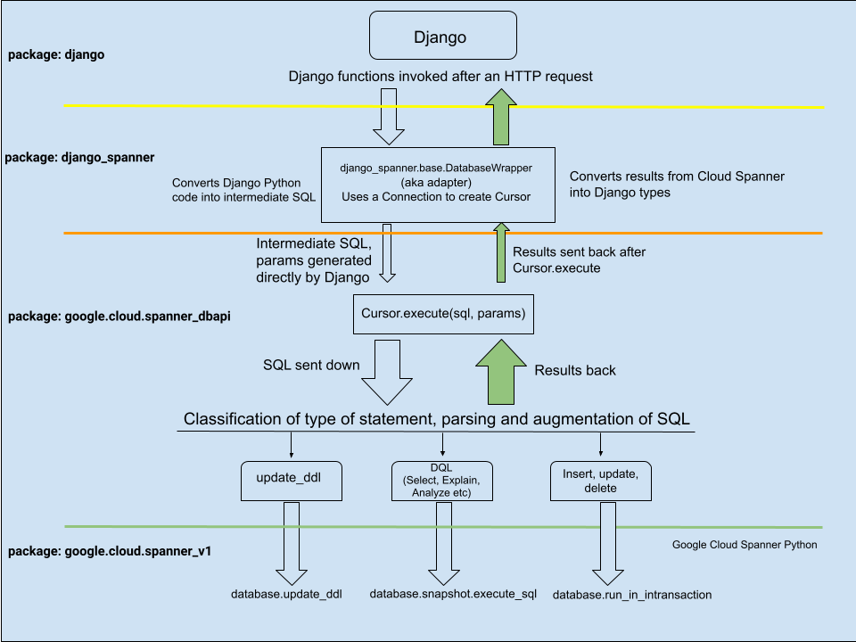

Cloud Spanner support for Django
================================

ORM plugin for using Cloud Spanner as a `database backend
<https://docs.djangoproject.com/en/2.2/ref/databases/#using-a-3rd-party-database-backend>`__
for Django.

How it works
------------

Overall design
~~~~~~~~~~~~~~

.. figure:: ./assets/overview.png
   :alt:

Internals
~~~~~~~~~

Installation
------------

Using this library requires a Google Cloud Platform project with the Cloud
Spanner API enabled. See the Spanner Python client `documentation
<https://github.com/googleapis/python-spanner/#quick-start>`__ for details.

The version of ``django-google-spanner`` must correspond to your version
of Django.  For example, ``django-google-spanner`` 2.2.x works with Django
2.2.y (Note: this is the only supported version at this time).

The minor release numbers of Django may not correspond to the minor release
numbers of ``django-google-spanner``. Use the latest minor release of each.

To install from PyPI:

.. code:: shell

    pip3 install django-google-spanner

To install from source:

.. code:: shell

    git clone git@github.com:googleapis/python-spanner-django.git
    cd python-spanner-django
    pip3 install -e .

Configuring ``settings.py``
~~~~~~~~~~~~~~~~~~~~~~~~~~~

After `installation <#Installation>`__, you'll have to update your Django
``settings.py`` file as follows.

-  Add ``django_spanner`` as the very first entry in the ``INSTALLED_APPS``
   settings:

   .. code:: python

       INSTALLED_APPS = [
           'django_spanner',
           ...
       ]

-  Edit the ``DATABASES`` settings to point to an EXISTING database, as shown in the following example:

   .. code:: python

       DATABASES = {
           'default': {
               'ENGINE': 'django_spanner',
               'PROJECT': '<GCP_project_id>',
               'INSTANCE': '<instance_id>',
               'NAME': '<database_name>',
           }
       }

-   In order to retrieve the Cloud Spanner credentials from a JSON file, the ``credentials_uri`` parameter can also be supplied in the ``OPTIONS`` field:

    .. code:: python

       DATABASES = {
           'default': {
               'ENGINE': 'django_spanner',
               'PROJECT': '<GCP_project_id>',
               'INSTANCE': '<instance_id>',
               'NAME': '<database_name>',
               'OPTIONS': {
                   'credentials_uri': '<credentials_uri>',
               },
           },
       }

Executing a query
~~~~~~~~~~~~~~~~~

.. code:: python

    from google.cloud.spanner_dbapi import connect

    connection = connect('<instance_id>', '<database_id>')
    cursor = connection.cursor()

    cursor.execute(
        "SELECT *"
        "FROM Singers"
        "WHERE SingerId = 15"
    )

    results = cursor.fetchall()

Current limitations
-------------------

``AutoField`` generates random IDs
~~~~~~~~~~~~~~~~~~~~~~~~~~~~~~~~~~

Spanner doesn't have support for auto-generating primary key values.
Therefore, ``django-google-spanner`` monkey-patches ``AutoField`` to generate a
random UUID4. It generates a default using ``Field``'s ``default`` option which
means ``AutoField``\ s will have a value when a model instance is created. For
example:

::

    >>> ExampleModel()
    >>> ExampleModel.pk
    4229421414948291880

To avoid
`hotspotting <https://cloud.google.com/spanner/docs/schema-design#uuid_primary_key>`__,
these IDs are not monotonically increasing. This means that sorting
models by ID isn't guaranteed to return them in the order in which they
were created.

``ForeignKey`` constraints aren't created (`#313 <https://github.com/googleapis/python-spanner-django/issues/313>`__)
~~~~~~~~~~~~~~~~~~~~~~~~~~~~~~~~~~~~~~~~~~~~~~~~~~~~~~~~~~~~~~~~~~~~~~~~~~~~~~~~~~~~~~~~~~~~~~~~~~~~~~~~~~~~~~~~~~~~~

Spanner does not support ``ON DELETE CASCADE`` when creating foreign-key
constraints, so this is not supported in ``django-google-spanner``.

Check constraints aren't supported
~~~~~~~~~~~~~~~~~~~~~~~~~~~~~~~~~~

Spanner does not support ``CHECK`` constraints so one isn't created for
`PositiveIntegerField
<https://docs.djangoproject.com/en/stable/ref/models/fields/#positiveintegerfield>`__
and `CheckConstraint
<https://docs.djangoproject.com/en/stable/ref/models/constraints/#checkconstraint>`__
can't be used.

No native support for ``DecimalField``
~~~~~~~~~~~~~~~~~~~~~~~~~~~~~~~~~~~~~~

Spanner's support for `Decimal <https://www.python.org/dev/peps/pep-0327/>`__
types is limited to
`NUMERIC <https://cloud.google.com/spanner/docs/data-types#numeric_types>`__
precision. Higher-precision values can be stored as strings instead.

``Variance`` and ``StdDev`` database functions aren't supported
~~~~~~~~~~~~~~~~~~~~~~~~~~~~~~~~~~~~~~~~~~~~~~~~~~~~~~~~~~~~~~~

Spanner does not support these functions.

``Meta.order_with_respect_to`` model option isn't supported
~~~~~~~~~~~~~~~~~~~~~~~~~~~~~~~~~~~~~~~~~~~~~~~~~~~~~~~~~~~

This feature uses a column name that starts with an underscore
(``_order``) which Spanner doesn't allow.

Random ``QuerySet`` ordering isn't supported
~~~~~~~~~~~~~~~~~~~~~~~~~~~~~~~~~~~~~~~~~~~~

Spanner does not support it and will throw an exception. For example:

::

    >>> ExampleModel.objects.order_by('?')
    ...
    django.db.utils.ProgrammingError: 400 Function not found: RANDOM ... FROM
    example_model ORDER BY RANDOM() ASC

Schema migrations
~~~~~~~~~~~~~~~~~

There are some limitations on schema changes to consider:

-  No support for renaming tables and columns;
-  A column's type can't be changed;
-  A table's primary key can't be altered.

``DurationField`` arithmetic doesn't work with ``DateField`` values (`#253 <https://github.com/googleapis/python-spanner-django/issues/253>`__)
~~~~~~~~~~~~~~~~~~~~~~~~~~~~~~~~~~~~~~~~~~~~~~~~~~~~~~~~~~~~~~~~~~~~~~~~~~~~~~~~~~~~~~~~~~~~~~~~~~~~~~~~~~~~~~~~~~~~~~~~~~~~~~~~~~~~~~~~~~~~~~~

Spanner requires using different functions for arithmetic depending on
the column type:

-  ``TIMESTAMP`` columns (``DateTimeField``) require ``TIMESTAMP_ADD``
   or ``TIMESTAMP_SUB``
-  ``DATE`` columns (``DateField``) require ``DATE_ADD`` or ``DATE_SUB``

Django does not provide ways to determine which database function to
use. ``DatabaseOperations.combine_duration_expression()`` arbitrarily uses
``TIMESTAMP_ADD`` and ``TIMESTAMP_SUB``. Therefore, if you use a
``DateField`` in a ``DurationField`` expression, you'll likely see an error
such as:

::

    "No matching signature for function TIMESTAMP\_ADD for argument types:
    DATE, INTERVAL INT64 DATE\_TIME\_PART."

Computations that yield FLOAT64 values cannot be assigned to INT64 columns
~~~~~~~~~~~~~~~~~~~~~~~~~~~~~~~~~~~~~~~~~~~~~~~~~~~~~~~~~~~~~~~~~~~~~~~~~~

Spanner does not support this (`#331
<https://github.com/googleapis/python-spanner-django/issues/331>`__) and will
throw an error:

::

    >>> ExampleModel.objects.update(integer=F('integer') / 2)
    ...
    django.db.utils.ProgrammingError: 400 Value of type FLOAT64 cannot be
    assigned to integer, which has type INT64 [at 1:46]\nUPDATE
    example_model SET integer = (example_model.integer /...

Addition with null values crash
~~~~~~~~~~~~~~~~~~~~~~~~~~~~~~~

Additions cannot include ``None`` values. For example:

::

    >>> Book.objects.annotate(adjusted_rating=F('rating') + None)
    ...
    google.api_core.exceptions.InvalidArgument: 400 Operands of + cannot be literal
    NULL ...
